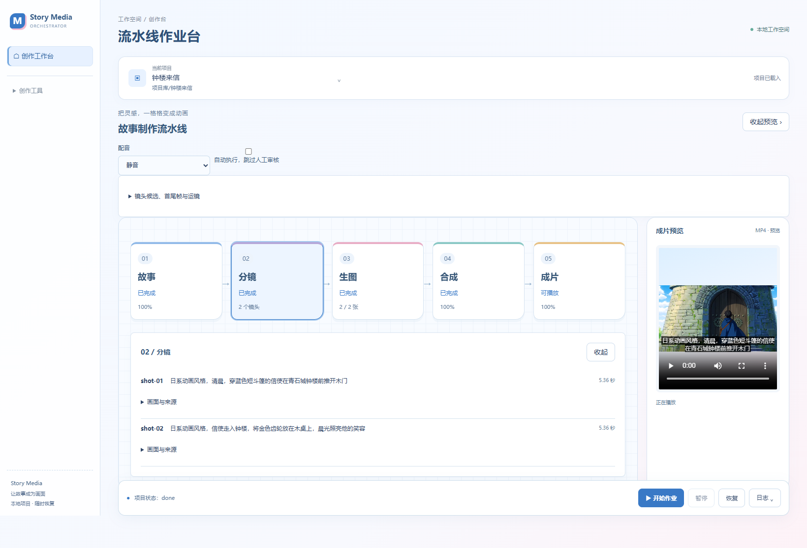

<div align="center">

# Story Media Orchestrator

### 把故事创意，做成看得见、能返工的 AI 视频工作流。

故事模板 · 分镜编排 · AI 生图 · 视频生成 · 预览与恢复

[观看真实演示](#真实演示) · [快速体验](#快速体验) · [定制开发合作](#定制开发合作)

**有想落地的 AI 产品或自动化流程？[联系我：2537676793@qq.com](mailto:2537676793@qq.com)**

</div>



这个项目把分散的 AI 生成步骤，组织成一套可以实际操作的桌面工作流：选择项目，写故事或选模板，查看分镜，生成素材，合成并播放。出错时保留进度，让下一次操作有据可查。

它也展示了我做项目时关注的事情：**把模型能力接入产品，把复杂流程做成清晰界面，把失败恢复纳入交付。**

## 真实演示


[查看原始 MP4](docs/assets/aliyun-preview.mp4) · [验收范围与当前限制](docs/VERIFICATION.md)

上面是两镜头媒体链路的实际输出：阿里云生图与视频生成，合成为 **10.72 秒、1280×720** 的 MP4，已验证完整播放与合成失败后的素材复用。GIF 为同一视频的压缩预览；界面截图使用这些验收素材。

另一次原模板故事验收生成了 **6 集、14 个场景、3 名角色**，通过模型最终审查，并导入为 **80 条分镜**。这是独立的故事验收，尚未将这 80 条分镜全部生成视频。模型审查结果供辅助判断，内容仍需人工审阅。

## 这个工作台能解决什么

- **流程集中。** 项目、故事、素材、合成结果放在同一个工作台，不用在多个界面之间手动搬运文件。
- **进度可见。** 按“故事 → 分镜 → 生图 → 合成 → 成片”查看状态，点击节点展开配置，高级参数默认收起。
- **返工有范围。** 保存素材、生成参数和任务回执；有效缓存可以复用，失败节点有明确记录。
- **生成可干预。** 故事模板、候选图片、首尾帧选择、人工审核节点和单镜头配置，支持逐步调整。
- **结果能查看。** 提供 MP4 播放、字幕、日志，以及可收起的右侧预览。

## 定制开发合作

我是这个项目的开发者。如果你有业务流程、产品原型，或者一套需要接入 AI 的现有系统，欢迎把需求发给我。

可以围绕以下方向沟通定制：

- **AI 应用与工作流**：故事创作、内容生产、资料处理、任务编排与自动化。
- **模型与业务系统集成**：模型 API、ComfyUI 工作流、已有服务和素材管理。
- **桌面工具与管理界面**：让复杂流程有清晰的操作入口、状态反馈和结果展示。
- **原型验证与持续迭代**：先明确可验收的核心路径，再逐步补齐功能、部署和维护。

**合作邮箱：[2537676793@qq.com](mailto:2537676793@qq.com)**
邮件标题建议：`项目合作｜你的项目名称`

简单介绍这几件事就可以开始：**谁来用、想解决什么、已有系统或参考、期望时间、预算范围**。我会结合需求讨论实现范围与验收方式，具体排期、费用及交付内容按项目确认。

公开的功能建议或问题反馈，也可以[创建 GitHub Issue](https://github.com/dgy-github/story-media-orchestrator/issues/new/choose)。商务资料和需要保密的信息请通过邮件沟通。

## 快速体验

先体验不需要模型密钥的本地故事卡预览。需要 **Python 3.11+**；当前桌面主要在 Windows 上验证。

```powershell
git clone https://github.com/dgy-github/story-media-orchestrator.git
cd story-media-orchestrator
python -m venv .venv
.venv\Scripts\Activate.ps1
python -m pip install -e ".[preview]"
python -m story_media_orchestrator.cli create my-story "信使来到钟楼。晨光照亮了城市。"
python -m story_media_orchestrator.cli run my-story --real-preview --image-source local
```

打开 `my-story/preview.mp4` 即可播放。这一步使用本地故事卡与静音轨，**不会调用付费生图或视频模型**。

需要 AI 生成、Windows 配音、桌面构建或项目恢复？继续看[安装与使用指南](docs/GETTING_STARTED.md)。

## 技术与工程设计

**Svelte + TypeScript** 负责工作台，**Tauri + Rust** 负责桌面桥接与可信服务边界，**Python + FFmpeg** 负责编排、素材处理和合成。

```text
故事模板 / 故事输入
        ↓
场景与分镜 → 图片 / 视频 / 配音
        ↓               ↓
项目状态 + 素材缓存 + 任务回执
        ↓
时间轴 / 字幕 / 合成 → MP4 预览
```

模型适配与流程状态分开组织。当前包含阿里云 DashScope 生图、Wan 视频、ComfyUI 适配和 Windows 本地语音；不同路线的验收状态见[验证记录](docs/VERIFICATION.md)。

本项目仍处于 **Alpha**。桌面完整功能依赖相邻的故事、图片和视频仓库，以及本机运行环境，目前不是免配置的一键安装包。商业定制能力与本仓库现成功能的范围，以实际需求和验收约定为准。

## 继续了解

- [安装、运行与常见问题](docs/GETTING_STARTED.md)
- [已验证能力与当前限制](docs/VERIFICATION.md)
- [合作方式与需求说明](docs/COLLABORATION.md)
- [架构目标](GOALS.md)
- [开发与贡献](CONTRIBUTING.md)

如果这个项目与你想做的产品接近，欢迎收藏仓库，或直接[发邮件聊需求](mailto:2537676793@qq.com)。
